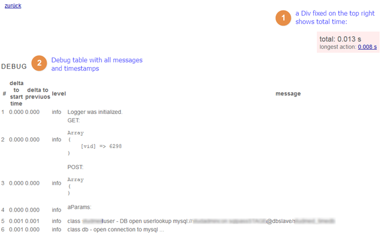

# Usage

## Initialization

Load the class file and instanciate it without params

```php
// load the class file
require '../classes/logger.class.php';

// optional: if you have a central wrapper then set a global var
global $oLog;

// inialize it
$oLog = new logger();
```

## Debug or measure something

With the `add` method yo can send 

* a string as first parameter and 
* optional: a loglevel as 2nd param. (default: "info"); other values you can define by yourself; common values are "warning" and "error". 

If you test some code you maybe manually write `print_r()` or `var_dump()` into your PHP files. With this class you always can use the `add ()` method. If the debug information is visible or not you can handle with the execution of the output function `render()`.

### Add debug data

A very useful example is to add the GET and POST params. Later it will be dumped as html so use the `pre` tag and `print_r()`:

```php
$oLog->add("INFO: all GET params: <pre>" . print_r($_GET,1) . "</pre>");
$oLog->add("INFO: all POST params: <pre>" . print_r($_POST,1) . "</pre>");
```

### Measure execution times

Trigger a message with add() to add a marker. Just use `add()` before and after any action you want to track. It can be an API request, a database query or an exec command.

```php
$oLog->add("start db request");
$sSql='select id, label, description from mytable;';

// ... make your query

$oLog->add("sql query finished: " . $sSql);
```


## Show debug data

The `render()` method will show you a table of all added log messages and tracks the processed time since init of the class and the delta time since the last logging entry.

For production do not execute render method. Wrap it with a flag. Maybe you aneble it on a given IP address or a GET param (which is unsafe) or based on a authenticated user.

```php
if ($bIsDevelopEnvironment){
    echo $oLog->render();
}
```

The slowest action will be marked in red.

Other colors of table rows you can define in your css class.

An additional div on top right shows the execution time total
and the time of the longest action (with a link to it).

