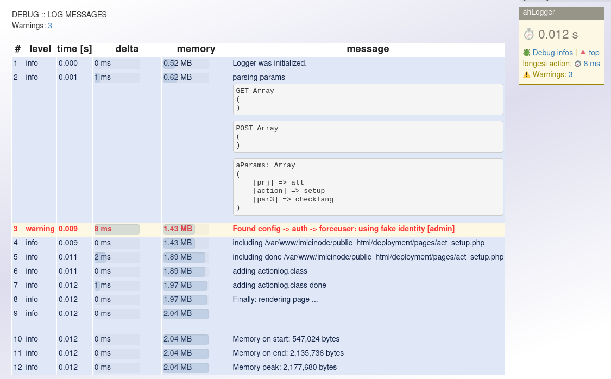

# ahLogger

Debug logging during a client request.
With this you can

- measure any action 
- find bottlenecks in your code.

You don't need to write any print_r and var_dump anymore and remove it
afterwards. Add _GET and _POST, and put a $oLog->add() at start and end
of any action you want to measure.

Compatible to PHP 8.3

👤 Author: Axel Hahn \
📄 Source: <https://github.com/axelhahn/ahlogger> \
📜 License: GNU GPL 3.0 \
📗 Docs: <https://www.axel-hahn.de/docs/ahlogger>

